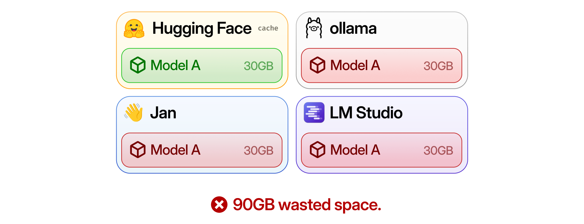
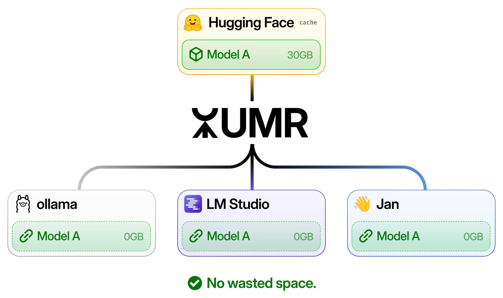

<p align="center">
  <picture>
    <source
      media="(prefers-color-scheme: dark)"
      srcset="./assets/umr-banner@dark.png"
    />
    <source
      media="(prefers-color-scheme: light)"
      srcset="./assets/umr-banner@light.png"
    />
    
  </picture>
</p>

<p align="center">
  <a href="#getting-started">Get Started</a>
  &nbsp;·&nbsp;
  <a href="#docs">Docs</a>
  &nbsp;·&nbsp;
  <a href="https://www.npmjs.com/package/umr-ai">NPM</a>
</p>

```
npm i -g umr-ai
```

# What is UMR?



UMR is the Unified Model Registry for your local AI apps. It allows you to maintain a single, centralized copy of a model to use across your favorite local AI apps, instead of having each one manage a separate copy.



That means you can:
- Save disk space
- Use the same model across all of your apps instantly
- Manage all your local models in one place

# Install

Install UMR via NPM or your JS package manager of choice.

```
npm i -g umr-ai
```

The `umr` CLI will be available after installation.

# Getting Started

Get started by adding a model to the UMR-maintained registry.

```bash
# Add a model from Hugging Face
# You will be prompted to choose a quant version
# This will use HF Cache, but UMR will now know about it
umr add hf ggml-org/gemma-4-E2B-it-GGUF

# Add a GGUF file manually
# This will make a copy of the GGUF to UMR's own store
umr add ./gemma-4-E2B-it-q8-0.gguf
```

After adding, check your available models

```bash 
# Output depends on which quant you chose
umr list


# NAME                 SOURCE  FORMAT  SIZE     CLIENTS    STATUS
# gemma-4-e2b-it-q8-0  hf      gguf    4.63 GB  -          ok
```

Now you can use the model in all your favorite apps right away. `umr link` is lightning fast, and the model should appear immediately in the linked app.

```bash
# Link the model to LM Studio
umr link lmstudio gemma-4-e2b-it-q8-0

# Link the model to Ollama
umr link ollama gemma-4-e2b-it-q8-0

# Link the model to Jan
umr link jan gemma-4-e2b-it-q8-0
```

Alternatively, you can also get the raw GGUF path to use with other AI runtimes

```bash
# Get the path to the GGUF
umr show gemma-4-e2b-it-q8-0 --path

# Run it with llama.cpp, for example
llama-cli -m "$(umr show gemma-4-e2b-it-q8-0 --path)"
```

# Docs

UMR has 3 main concepts:

- **Source**: where a model comes from, like Hugging Face or a local file
- **Model**: the canonical instance of a model's weights UMR tracks and stores
- **Client**: an app that uses that model, like LM Studio, Ollama, or Jan

*Note that Models are not always a literal file stored by UMR. Often, they are a reference, such as to existing Hugging Face Cache. UMR simply keeps track of where all the files are.*

Whenever you add a Model from a Source, you can use that Model across all your Clients, without needing to store an extra copy of it. In order to do that, UMR either hardlinks a copy of the model into the Client's own model directory, or simply points the Client over to UMR's managed instance of the model.

## Commands

### `umr add`

Add a model to UMR from Hugging Face or a local GGUF file.

There are two supported **Sources** for UMR currently.

#### Hugging Face

When you add a Hugging Face model, UMR will attempt to find the model in your HF Cache first (see available models with `hf cache list`). If not present, UMR will ask if you want to install it. Note that if a repo has multiple GGUF files, UMR will let you pick one.

```bash
umr add hf <repo>
```

#### Local File

When you add a local file, UMR will clone a copy of the file into its own store in `~/.umr` (by default). This is to prevent changes to the original copy of the file messing with the UMR managed copy.

```bash
umr add ./model.gguf
```

### `umr list`

List the models UMR is tracking, including source, format, linked clients, and status.

```bash
umr list
```

### `umr show`

Show details for a tracked model, or print only the managed file path with `--path`.

```bash
umr show <model>
umr show <model> --path
```

The `--path` flag is useful for passing a path to the model for clients that require a path like `llama.cpp`. For example, you may write:

```bash
llama-cli -m "$(umr show gemma-4-e2b-it --path)"
```

### `umr link`

Link a tracked model to a client app.

```bash
umr link lmstudio <model>
umr link ollama <model>
umr link jan <model>
```

Each client app uses a different linking method under-the-hood, but generally, all of them should be incredibly fast (especially compared to downloading the file). Occasionally, you may need to restart the app for it to discover the new models.

### `umr unlink`

Remove the linked model from a Client.

```bash
umr unlink lmstudio <model>
umr unlink ollama <model>
umr unlink jan <model>
```

Occasionally, you may need to restart the app for the unlinking to take effect.

### `umr remove`

Remove a model from UMR tracking. A model must be unlinked from all clients before it can be removed.

```bash
umr remove <model>
```

Note that remove will only remove UMR's *tracking* of the model and not necessarily the model itself. That is:

* **Hugging Face Sources**: When these models are removed, they will _not_ be deleted from Hugging Face cache.
* **Local Sources**: When these models are removed, the instance stored in UMR will be deleted.

### `umr check`

Check UMR for missing files or stale client links. Some errors may be automatically fixable.

```bash
umr check
```

Use `--fix` to remove stale UMR-side links automatically when it is safe to do so.

```bash
umr check --fix
```

For example, if you link a model to a Client and then delete it Client-side, you may need to run `umr check --fix` to help UMR update its own Registry to reflect that.