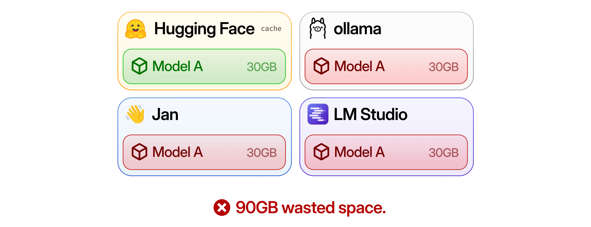
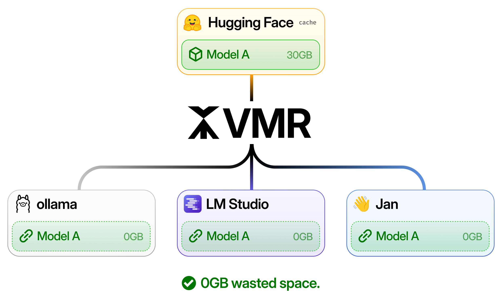

<p align="center">
  <picture>
    <source
      media="(prefers-color-scheme: dark)"
      srcset="./assets/vmr-banner@dark.png"
    />
    <source
      media="(prefers-color-scheme: light)"
      srcset="./assets/vmr-banner@light.png"
    />
    
  </picture>
</p>

<p align="center">
  <a href="#getting-started">Get Started</a>
  &nbsp;·&nbsp;
  <a href="#what-is-vmr">Docs</a>
  &nbsp;·&nbsp;
  <a href="https://www.npmjs.com/package/vmr-ai">NPM</a>
</p>

```
npm i -g vmr-ai
```

# What is VMR?



The Virtual Model Registry (VMR) allows you to maintain a single, centralized copy of a model's weights for every local AI app across your system.



By either linking model files or pointing the AI app to the VMR-maintained copy of the model weights, VMR helps you save storage space and unify management of your local AI models.

# Install

Install VMR via NPM or your JS package manager of choice.

```
npm i -g vmr-ai
```

# Getting Started

Get started by adding a model to the VMR-maintained registry.

```bash
# Add a model from Hugging Face
# This will use HF Cache, but VMR will now know about it
vmr add hf ggml-org/gemma-4-E2B-it-GGUF

# Add a GGUF file manually
# This will make a copy of the GGUF to VMR's own store
vmr add ./gemma-4-E2B-it-q8-0.gguf
```

After adding, check your available models

```bash 
# Output depends on which quant you chose
vmr list

# NAME                 SIZE      TARGETS       STATUS
# gemma-4-e2b-it-q8-0  4.63 GB   -             ok
```

Now, you can use your available model with your favorite apps!

```bash
# Link the model to LM Studio
vmr link lmstudio gemma-4-e2b-it-q8-0

# Link the model to Ollama
vmr link ollama gemma-4-e2b-it-q8-0

# Link the model to Jan
vmr link jan gemma-4-e2b-it-q8-0
```

Or, get the GGUF path to use with other AI runtimes

```bash
# Get the path to the GGUF
vmr show gemma-4-e2b-it --path

# Run it with llama.cpp, for example
llama-cli -m "$(vmr show gemma-4-e2b-it --path)"
```
